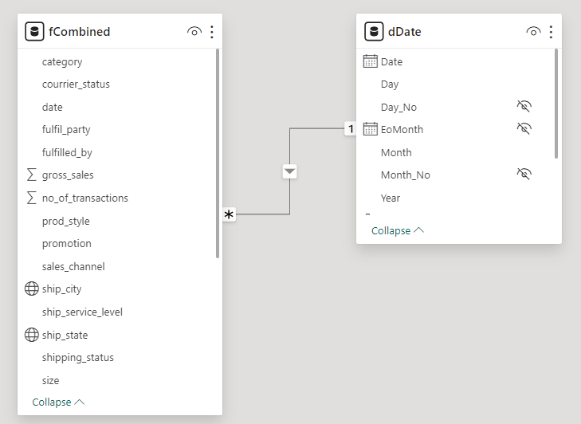

# Amazon Sales Dataset
## Source:
Dataset: [Kaggle.com](https://www.kaggle.com/datasets/karkavelrajaj/amazon-sales-dataset)
Worthy Tutorial: [Excel Is Fun](https://www.youtube.com/results?search_query=excel+is+fun)
## Introduction
This analysis presents the sales overview and trends of the dataset above. The sales overview is by product, size, region, shipping methods, and trends for the dataset.
## Analysis Steps
1. Identify the dataset.
2. Loading data to PowerQuery.
3. Cleaning the data.
4. Loading cleaned data to PowerBI.
5. Creating Date Table.
6. Creating a Data Model.
7. Creating Measures.
8. Testing Measures.
9. Creating Visuals.
### Identify the Dataset
The dataset is from the link above.
### Loading Data to PowerQuery
Use the transform data command to load data to PowerQuery.
### Cleaning the Data
Remove unnecessary columns and duplicates from the data.
### Loading Cleaned Data to PowerBI
Use the closed and apply command to load the data to PowerBI.
### Creating Date Table
Use calendar measures to create tables.
### Creating a Data Model
Connect sales data and date tables as below:

### Creating Measures
Use PowerBI functions to create measures that would be used in creating visuals.
### Testing Measures
Use Matrix Visual to test the measures.
### Creating Visuals
Below is the result:
#### Power BI Dashboard

### Why I Picked This Dataset
I am curious about how businesses perform in commercial markets based on regions and product categories, and Amazon, being a multi-national company in e-commerce fits that profile. I analyzed this dataset in PowerBI to sharpen my skills in creating visuals in data analysis.
